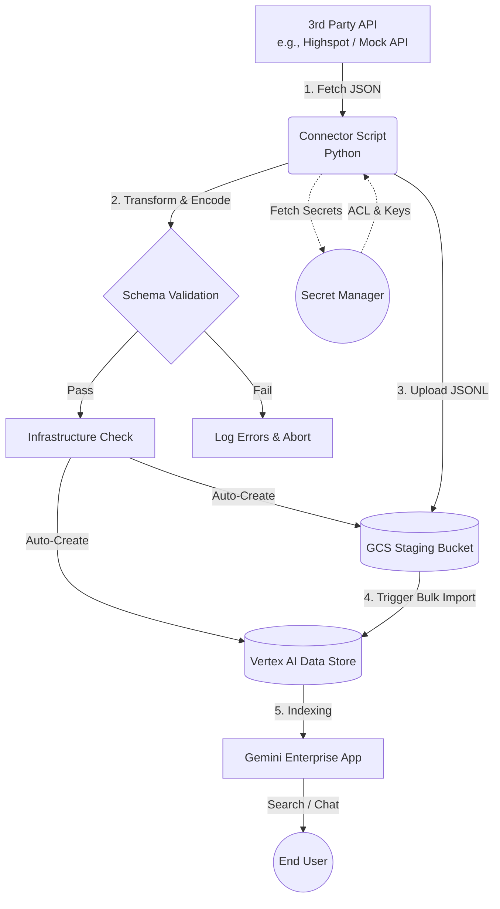

# Gemini Enterprise Custom Connector

A production-ready custom connector framework for **Google Discovery Engine** (Vertex AI Search). This project implements the official **GCS Staging Pattern**, enabling high-volume data ingestion from any REST API (e.g., Highspot, Salesforce, JSONPlaceholder) into a searchable enterprise knowledge base.

---

## What this connector does

Follows the official Google Fetch → Transform → Sync pattern:

1. **FETCH** — calls `GET /posts` and `GET /users` on JSONPlaceholder
2. **TRANSFORM** — converts each post to a Discovery Engine Document (JSONL)
3. **VALIDATE** — local schema check before any GCP call
4. **INFRASTRUCTURE CHECK** — auto-provisions GCS bucket and Data Store if missing
5. **GCS UPLOAD** — writes JSONL to Cloud Storage staging bucket
6. **DE IMPORT** — calls Discovery Engine import API to index documents
7. **GE APP** — data store connected to GE App → searchable in chat

---

## Architecture

The connector follows Google's recommended **Fetch → Transform → Sync** pipeline for maximum reliability and scalability.



## **Security: Access Control (ACL) & Secret Manager**

This connector implements **Enterprise Document-Level Security**. This means that when data is synced to Gemini, it is tagged with specific permissions.

### **1. Secret Manager Setup**
The connector dynamically fetches the "Security Policy" from Google Secret Manager.

**Create the ACL mapping secret:**
```bash
echo -n '{"readers": [{"user": "your-email@example.com"}, {"group": "all-engineers@example.com"}]}' | \
gcloud secrets create ge-acl-mapping --data-file=-
```

### **2. How it Works (Identity Join)**
- **Step 1:** The connector pulls your policy from the secret.
- **Step 2:** Every JSONL document is tagged with these specific `readers`.
- **Step 3:** At search-time, Gemini checks the identity of the user asking the question. 
- **Step 4:** If the user is **not** in the "Readers" list, the document is hidden from them.

### **3. Setting up "Access for All"**
To give everyone in your company access:
Update the secret to include a domain-wide group:
`{"readers": [{"group": "everyone@yourdomain.com"}]}`

---

## **Key Features**
- **Auto-Provisioning:** Automatically creates GCS buckets and **ACL-enabled** Data Stores.
- **Enterprise Security:** Documents are tagged with `AclInfo` to enforce per-user permissions.
- **Scalable Sync:** Uses Google's optimized GCS staging pattern for bulk ingestion.

---

## Project Structure

```text
.
├── connector.py            # Main production script (Fetch -> Transform -> Sync)
├── mock_service.py         # Dynamic local API for randomized testing
├── test_incremental_flow.py# Automated end-to-end test orchestration
├── requirements.txt        # Google Cloud & HTTP dependencies
├── Dockerfile              # Container definition for Cloud Run Jobs
├── .env.example            # Template for required environment variables
└── setup.sh                # GCP infrastructure deployment script
```

---

## Getting Started

### 1. Installation
```bash
# Create and activate virtual environment
python3 -m venv venv
source venv/bin/activate

# Install dependencies
pip install -r requirements.txt
```

### 2. Configuration
Copy `.env.example` to `.env` and configure your GCP and Source settings:
```env
GCP_PROJECT_ID=your-project-id
GCS_BUCKET=your-staging-bucket
DATA_STORE_ID=your-data-store-id
SOURCE_BASE_URL=https://jsonplaceholder.typicode.com
SECRET_API_CREDENTIALS=your-api-key-secret-name
SECRET_ACL_MAPPING=your-acl-mapping-secret-name
```

---

## Usage & Testing

### **Incremental Sync Test (Mock Data)**
To analyze incremental sync behavior without hitting real APIs or incurring costs:

1. **Start the Mock API** (Terminal 1):
   ```bash
   python3 mock_service.py
   ```
2. **Run the Automated Flow** (Terminal 2):
   ```bash
   python3 test_incremental_flow.py
   ```
   *This script handles the full lifecycle: Initial Sync -> Source Update -> Incremental Sync -> Verification.*

### **Production Command Line**
```bash
# Perform a Full Sync
python3 connector.py

# Perform an Incremental Sync (since yesterday)
python3 connector.py --since "2026-04-01T00:00:00Z"

# Safe Preview (Local transform only, no GCP upload)
python3 connector.py --preview
```

---

## Deployment (Production)

The connector is fully prepared for cloud-native deployment:

### **1. Containerization**
The included `Dockerfile` follows security best practices (non-root user, slim image).
```bash
# Build the image
docker build -t ge-connector .
```

### **2. GCP Automation (`setup.sh`)**
Use `setup.sh` to automate the deployment of:
- **Cloud Run Jobs:** To execute the `connector.py` in a managed, serverless environment.
- **Cloud Scheduler:** To trigger the sync job automatically every 4 hours (configurable).
- **Service Accounts:** Automatically provisions `ge-connector-sa` with restricted IAM roles (`storage.admin`, `discoveryengine.editor`, `secretmanager.secretAccessor`).

---

## Adaptation Guide
To adapt this for **Highspot** or other enterprise sources:
1. Replace `fetch_data()` in `connector.py` with your source's authenticated API calls.
2. Update `build_discovery_engine_doc()` to map your source's specific JSON schema to the Discovery Engine format.
3. Keep all GCS and Discovery Engine logic—it is already optimized for production use.
