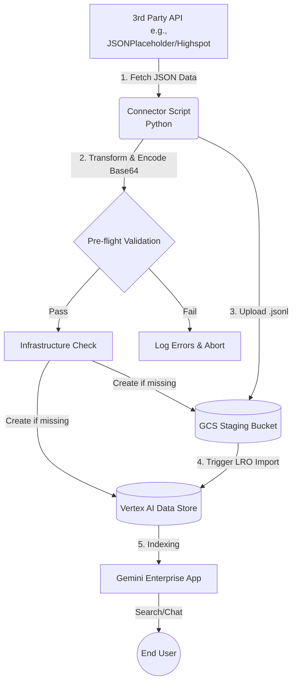

# Gemini Enterprise Custom Connector

**Purpose:** A production-ready test connector that uses JSONPlaceholder
(free fake REST API) as the data source, following Google's official custom
connector architecture from:
https://docs.cloud.google.com/gemini/enterprise/docs/connectors/create-custom-connector

Once you confirm this works end-to-end, replace the JSONPlaceholder
fetch functions with Highspot API calls — all GCS + Discovery Engine
sync logic stays identical.

---

## Project structure

```
jsonplaceholder-ge-connector/
├── connector.py        ← main connector (fetch + transform + sync)
├── test_local.py       ← local validation before touching GCP
├── requirements.txt    ← Python dependencies
├── Dockerfile          ← for Cloud Run Job deployment
├── .env.example        ← copy to .env and fill in your values
├── setup.sh            ← GCP setup commands (run manually section by section)
└── README.md           ← this file
```

---

## What this connector does

Follows the official Google Fetch → Transform → Sync pattern:

1. **FETCH** — calls `GET /posts` and `GET /users` on JSONPlaceholder
2. **TRANSFORM** — converts each post to a Discovery Engine Document (JSONL)
3. **VALIDATE** — local schema check before any GCP call
4. **INFRASTRUCTURE CHECK** — auto-provisions GCS bucket and Data Store if missing
5. **GCS UPLOAD** — writes JSONL to Cloud Storage staging bucket
6. **DE IMPORT** — calls Discovery Engine import API to index documents
7. **GE APP** — data store connected to GE App → searchable in chat

### Custom Connector Architecture Flowchart



---

## Step-by-step guide

### Phase 1 — Local setup and testing (no GCP required)

**Step 1.1 — Install dependencies**

```bash
pip install -r requirements.txt
```

**Step 1.2 — Run local tests first**

This validates the fetch + transform + validate pipeline completely locally.
No GCP credentials needed at this stage.

```bash
python test_local.py
```

Expected output:
```
✅ ALL TESTS PASSED — Ready to run against GCP
```

This also creates `output_sample.jsonl` — inspect this file:
```bash
cat output_sample.jsonl | python -m json.tool | head -80
```

Confirm each line looks like this:
```json
{
  "id": "jsonplaceholder-post-1",
  "structData": {
    "title": "sunt aut facere repellat...",
    "author": "Bret",
    "source": "JSONPlaceholder",
    "url": "https://jsonplaceholder.typicode.com/posts/1"
  },
  "content": {
    "mimeType": "text/plain",
    "rawBytes": "VGl0bGU6..."
  }
}
```

✅ **Checkpoint:** All 100 posts validated, JSONL looks correct.

---

### Phase 2 — GCP prerequisites

**Step 2.1 — Enable APIs**

```bash
gcloud services enable \
  discoveryengine.googleapis.com \
  storage.googleapis.com \
  run.googleapis.com \
  cloudbuild.googleapis.com \
  secretmanager.googleapis.com
```

**Step 2.2 — Create a dedicated Service Account**

```bash
gcloud iam service-accounts create ge-connector-sa \
  --description="Service account for Gemini Enterprise Connector" \
  --display-name="GE Connector SA"
```

**Step 2.3 — Grant IAM roles**

Grant the required roles to the new Service Account so it can run securely in Cloud Run:

```bash
SA_EMAIL="ge-connector-sa@YOUR_PROJECT_ID.iam.gserviceaccount.com"

gcloud projects add-iam-policy-binding YOUR_PROJECT_ID \
  --member="serviceAccount:${SA_EMAIL}" \
  --role="roles/discoveryengine.editor"

gcloud projects add-iam-policy-binding YOUR_PROJECT_ID \
  --member="serviceAccount:${SA_EMAIL}" \
  --role="roles/storage.admin"

gcloud projects add-iam-policy-binding YOUR_PROJECT_ID \
  --member="serviceAccount:${SA_EMAIL}" \
  --role="roles/secretmanager.secretAccessor"
```

*(Note: If you plan to run the connector locally in Phase 3, ensure your personal user account `user:your-email@example.com` also has these same three roles.)*

✅ **Checkpoint:** APIs enabled, Service Account created, and IAM Roles granted.

*(Note: The connector script will now automatically create the GCS bucket and the Discovery Engine Data Store if they do not exist.)*

---


### Phase 3 — Run connector locally (first real sync)

**Step 3.1 — Set up environment variables**

```bash
cp .env.example .env
```

**Step 3.2 — Authenticate to GCP**

```bash
gcloud auth application-default login
```

**Step 3.3 — Run connector in preview mode first**

```bash
GCP_PROJECT_ID=your-project \
GCS_BUCKET=jsonplaceholder-ge-connector-staging \
DATA_STORE_ID=jsonplaceholder-test-store \
SYNC_MODE=full \
venv/bin/python connector.py --preview
```

This runs fetch + transform + validate WITHOUT uploading to GCP.
Confirm the logs show 100 documents and no errors.

**Step 3.4 — Run the full connector**

```bash
GCP_PROJECT_ID=your-project \
GCS_BUCKET=jsonplaceholder-ge-connector-staging \
DATA_STORE_ID=jsonplaceholder-test-store \
SYNC_MODE=full \
SECRET_API_CREDENTIALS=your-api-credentials-secret-name \
SECRET_ACL_MAPPING=your-acl-mapping-secret-name \
venv/bin/python connector.py
```

✅ **Checkpoint:**
- Terminal shows "✅ Connector run complete"
- The bucket `jsonplaceholder-ge-connector-staging` is automatically created.
- The Data store `jsonplaceholder-test-store` is automatically created.
- GCS bucket contains `documents/jsonplaceholder_posts.jsonl`
- GCP Console → Gemini Enterprise → Data Stores → `jsonplaceholder-test-store`
  shows document count = 100 and status = Active

---

### Phase 4 — Connect data store to GE App

**Step 4.1**
GCP Console → Gemini Enterprise → **Apps**

**Step 5.2**
Click your existing app OR click **Create app** → choose **Search** type → name it `Test Search App`

**Step 5.3**
Inside the app, click **Connected data stores** → **+ New data store**

**Step 5.4**
Select `jsonplaceholder-test-store` → click **Save**

**Step 5.5**
Wait for status to show **Active** (usually 1–3 minutes)

✅ **Checkpoint:** App shows `jsonplaceholder-test-store` connected with status Active.

---

### Phase 6 — Test in GE chat

**Step 6.1**
Open GE web UI (your org's GE URL or the URL shown in the App settings)

**Step 6.2**
Click **New chat** → click the **Connectors icon** (plug icon at bottom of input)

**Step 6.3**
Enable `jsonplaceholder-test-store`

**Step 6.4**
Ask test questions:

| Query | Expected result |
|---|---|
| "Find posts about sunt aut facere" | Returns post 1 |
| "Show me posts by Bret" | Returns posts by user Bret |
| "What posts are from JSONPlaceholder?" | Returns multiple results |
| "Find content about dolorem" | Semantic search hits |

✅ **Checkpoint:** GE returns results that reference JSONPlaceholder posts with source attribution.

---

### Phase 7 — Deploy to Cloud Run for automation (optional)

**Step 7.1 — Build and push container**

```bash
gcloud builds submit \
  --tag gcr.io/YOUR_PROJECT_ID/jsonplaceholder-ge-connector \
  --project YOUR_PROJECT_ID
```

**Step 7.2 — Create Cloud Run Job**

```bash
SA_EMAIL="ge-connector-sa@YOUR_PROJECT_ID.iam.gserviceaccount.com"

gcloud run jobs create jsonplaceholder-sync-job \
  --image gcr.io/YOUR_PROJECT_ID/jsonplaceholder-ge-connector \
  --region us-central1 \
  --max-retries 2 \
  --service-account="${SA_EMAIL}" \
  --set-env-vars "GCP_PROJECT_ID=YOUR_PROJECT_ID,GCS_BUCKET=jsonplaceholder-ge-connector-staging,DATA_STORE_ID=jsonplaceholder-test-store,SYNC_MODE=full,SECRET_API_CREDENTIALS=your-api-credentials-secret-name,SECRET_ACL_MAPPING=your-acl-mapping-secret-name"
```

**Step 7.3 — Test the Cloud Run Job manually**

```bash
gcloud run jobs execute jsonplaceholder-sync-job \
  --region us-central1 \
  --wait
```

✅ **Checkpoint:** Job runs successfully. Check logs in GCP Console → Cloud Run → Jobs.

---

## How to adapt this for Highspot

Once this connector works end-to-end with JSONPlaceholder, adapting it for
Highspot requires changing only 3 things:

1. **Replace `fetch_posts()` and `fetch_users()`** with Highspot API calls:
   ```python
   def fetch_spots():
       resp = requests.get(f"{HIGHSPOT_URL}/v1/spots",
                           auth=(API_KEY, API_SECRET))
       return resp.json().get("spots", [])
   ```

2. **Update `build_document()`** to map Highspot fields:
   ```python
   "id": f"highspot-item-{item['id']}",
   "structData": {
       "title": item.get("title"),
       "spot":  spot.get("title"),
       ...
   }
   ```

3. **Update environment variables** with Highspot credentials:
   ```
   HIGHSPOT_INSTANCE=https://api-su2.highspot.com
   HIGHSPOT_API_KEY=your-key
   HIGHSPOT_API_SECRET=your-secret
   ```

Everything else — GCS upload, Discovery Engine import, GE App connection — stays **exactly the same**.

---

## Official reference docs

| Topic | URL |
|---|---|
| Custom connector overview | docs.cloud.google.com/gemini/enterprise/docs/connectors/custom-connector |
| Create custom connector | docs.cloud.google.com/gemini/enterprise/docs/connectors/create-custom-connector |
| Prepare data (JSONL format) | docs.cloud.google.com/gemini/enterprise/docs/connectors/prepare-data |
| Connect GCS data source | docs.cloud.google.com/gemini/enterprise/docs/connectors/connect-cloud-storage |
| Connect data store to app | docs.cloud.google.com/gemini/enterprise/docs/connectors/connect-existing-data-store |
| Discovery Engine Document format | cloud.google.com/generative-ai-app-builder/docs/reference/rest/v1/projects.locations.collections.dataStores.branches.documents |
